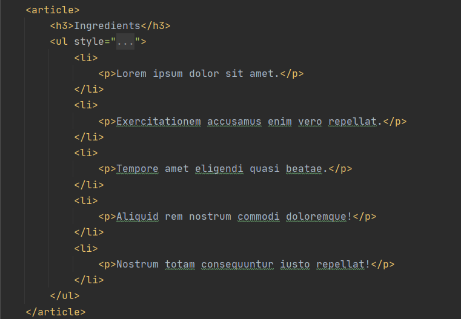

# Kodluyoruz First Repository
---
This repository is the first repository during [kodluyoruz](https://kodluyoruz.org) training. It includes one README.md file and one index.html file.

### Image of basic HTML recipe page.




 # Installation
 1. First clone the project (Following statement will include the link you take from your repository )
 
 ```
 git clone https://github.com/enesuur/coding-first-repository.git 
 
  ```
  ---

  # Usage
  2. After cloning the project open Visual Studio Code.

 For Linux:
  ```
  cd coding-first-repository
  ```
For Windows:
```
code .
```
# Contributing
All **pull requests** are acceptable it is only for learning markdown. :)

# License

[MIT](https://en.wikipedia.org/wiki/MIT_License)